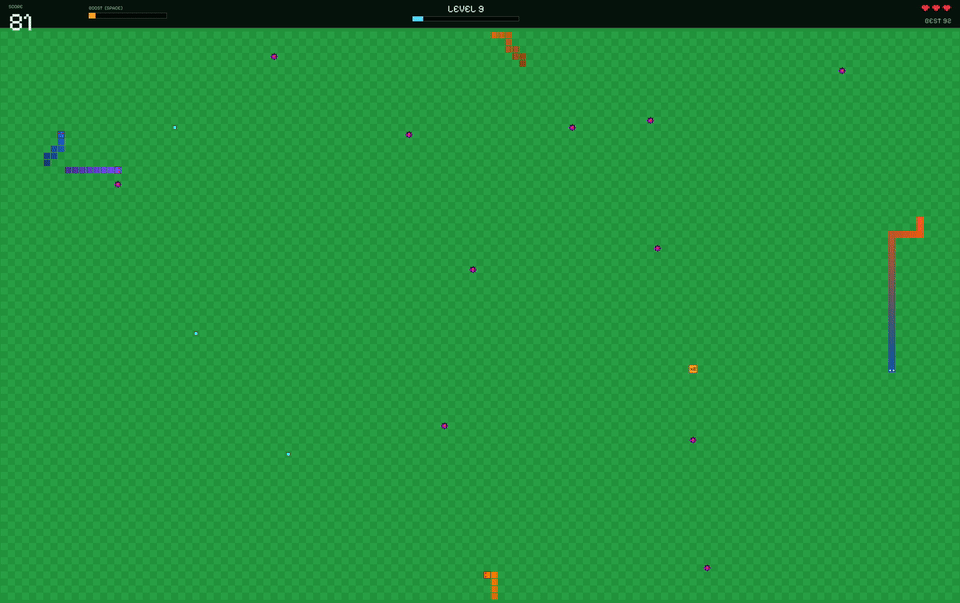

# Snake Game in Rust (SDL2)

## Overview



Snake game implemented in [Rust](https://www.rust-lang.org/learn/get-started) using the [SDL2](https://wiki.libsdl.org/SDL2/FrontPage) library. Collect eggs to grow longer while avoiding self-collision. The game supports teleporting at screen edges, and visual feedback when attempting illegal moves.

## Features
- High-paced: quick base speed, faster ramp-up, and a quick-tempo enemy
- **PS4 / gamepad support** via SDL2's controller API (D-pad + left stick, hot-plug)
- Title screen, pause, game over and instant restart (ENTER)
- **Enemy snakes** (from level 2) that hunt eggs or try to cut you off; they crash into things and leave golden eggs. They are drawn as solid armoured segments with a dark outline, a bright scale plate and a spiked, fanged head, so they stay clearly visible and never read as the player's plain blocks
- **Boost**: hold SPACE/SHIFT to go twice as fast, drawing on a meter that refills. Boost into an enemy's body to ram it in half
- **Power-ups**: Shield (absorbs a hit), Ghost (pass through bodies), Freeze (stops enemies), 2x Score
- Cyan eggs (+1) and golden eggs (+3, they vanish)
- Red viruses: each hit costs a life and part of your tail (3 lives)
- Levels: speed rises and more viruses and enemies appear every 10 points
- HUD with level progress, lives, boost meter and active power timers; floating score popups
- Persistent high score and resumable round, stored together in a zipped `game.gamedump`

## Requirements
To run this game, you need:
- Rust and Cargo installed
- SDL2 installed on your system
- SDL2_ttf for text rendering

## Installation
1. Clone this repository:
   ```sh
   git clone https://github.com/rubbieKelvin/snake.git
   cd snake
   ```
2. Install dependencies:
   ```sh
   cargo build
   ```
3. Run the game:
   ```sh
   cargo run
   ```

## Controls
| Key      | Action               |
|----------|----------------------|
| W / UP   | Move Up              |
| A / LEFT | Move Left            |
| S / DOWN | Move Down            |
| D / RIGHT| Move Right           |
| P        | Pause/Resume Game    |
| SPACE / SHIFT (hold) | Boost  |
| ENTER    | Start / restart      |
| ESC      | Quit the Game        |
| D-pad / left stick | Move (gamepad)  |
| Cross (A) | Start / resume (gamepad) |
| Circle (B) / R2 | Boost (hold, gamepad) |
| START / OPTIONS | Pause / resume (gamepad) |
| Triangle (Y) | Continue saved round (gamepad) |

## How to Play
- Eat eggs to grow and score; avoid viruses, enemy snakes and your own body.
- Hits cost a life (and part of your tail). Biting yourself or losing all lives ends the game.
- Boost into an enemy's *body* to cut it and score the severed cells. Hitting its head, or not boosting, hurts you.

## Dependencies
The game uses the following Rust crates:
- `sdl2` for graphics, events, and rendering
- `sdl2::ttf` for text rendering
- `rand` for generating random positions
- `serde` / `serde_json` for the saved game dump
- `flate2` / `crc32fast` for the deflated zip container (`game.gamedump`)
- `lewton` for decoding the OGG sound effects

## Future Improvements
- Textures/sprites
- Difficulty selection and power-ups

## License
This project is licensed under the MIT License.

Sound effects in `assets/sounds` are from [Kenney's Sci-Fi Sounds](https://www.kenney.nl) (CC0).
